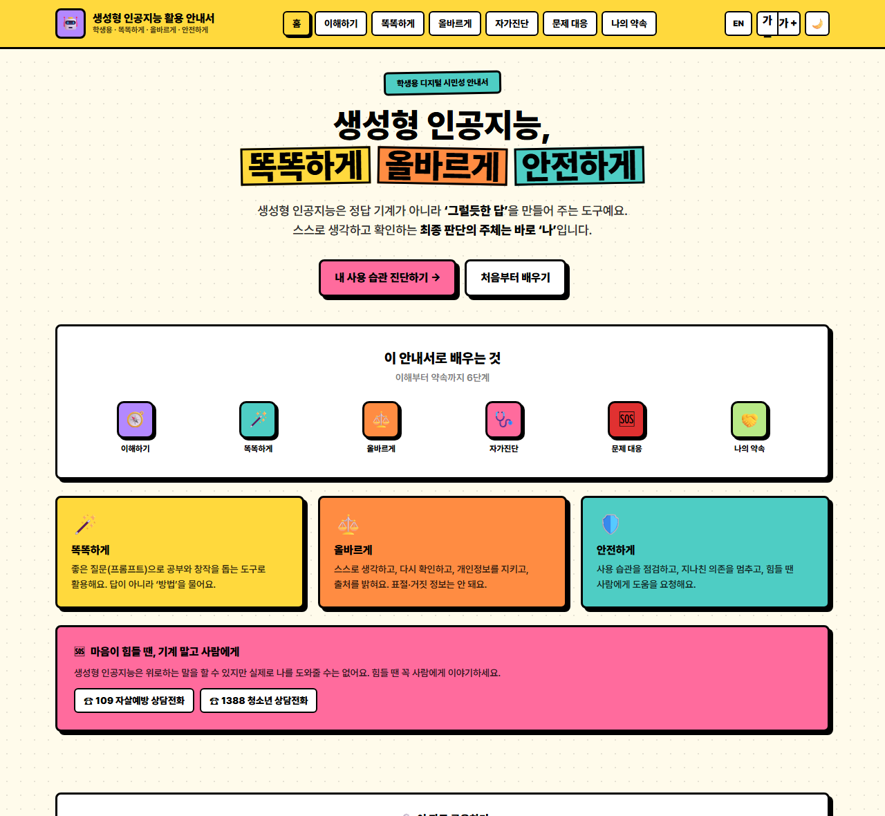
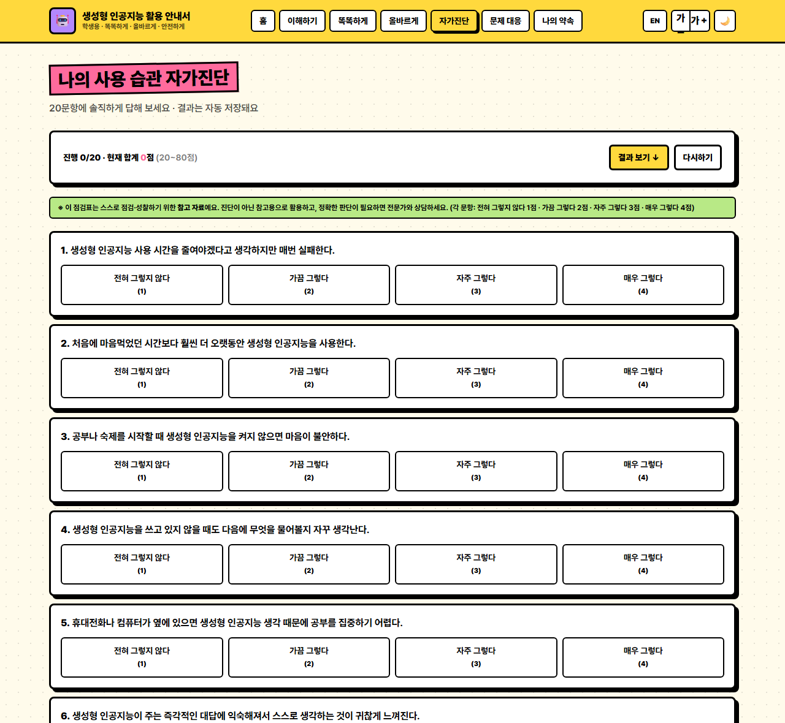
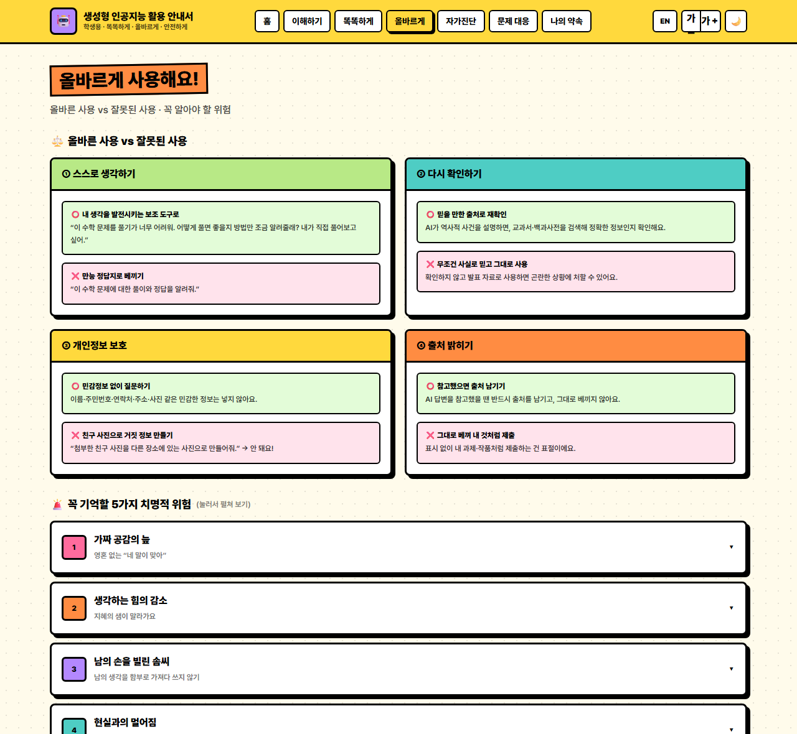
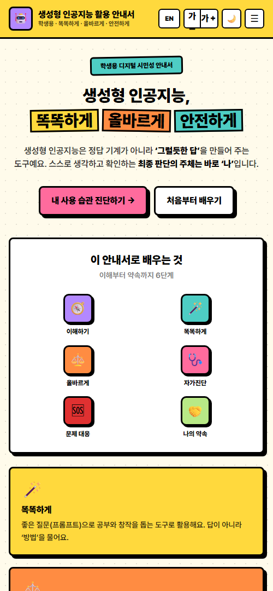

<div align="center">

# 🤖 생성형 인공지능 활용 안내서 <sub>· 학생용</sub>

### 똑똑하게 · 올바르게 · 안전하게

충청남도교육청 인쇄용 안내서(22p)를 **인터랙티브 단일 웹페이지**로 재탄생시킨 디지털 시민성 지도자료
<br/>네오브루탈리즘 디자인 · 설치 없이 한 파일로 동작

<br/>

[](https://tigerjk9.github.io/Student-Guide-to-Using-Generative-AI/)

<br/>


<br/>



</div>

<br/>

## ✨ 특징

- 🎨 **네오브루탈리즘** — 두꺼운 검정 테두리 · 흐림 없는 하드 섀도우 · 단색 강조의 또렷한 포스터 감성
- 📱 **완전 반응형** — 스마트폰 · 태블릿 · 전자칠판까지 깨짐 없이
- 🌐 **한국어 / English 토글** — 헤더 버튼 한 번으로 전체 콘텐츠 전환 (다문화 학생 대응)
- 🌙 **다크 모드 · 글자 크기 3단계** — 야간·저시력 환경 배려, 선택은 자동 저장
- 🧩 **인터랙티브** — 점수형 자가진단 · 저장형 약속 체크리스트 · 복사형 프롬프트
- 🖨️ **인쇄 / PDF · QR 공유** — 학습지로 출력하거나 QR·링크로 교실에 바로 배부
- 💾 **자동 저장** — 진단 결과·약속·언어·테마를 `localStorage`에 보관 (서버 전송 0)
- 📦 **단일 파일** — `index.html` 하나. 빌드 도구·서버·외부 이미지 없이 어디서나 바로 실행
- ♿ **접근성** — 건너뛰기 링크 · 키보드 포커스 · `aria` 라벨 · 큰 터치 타깃

<br/>

## 📚 담은 내용 — 7개 탭

| 탭 | 내용 | 하이라이트 |
|----|------|-----------|
| 🏠 **홈** | 3대 원칙·학습 흐름 | 109·1388 상담 안내 |
| 🧭 **이해하기** | 디지털 문해력/시민성, AI의 원리 | 5가지 한계 아코디언 |
| 🪄 **똑똑하게** | 프롬프트 작성법, 상담 활용 | **복사형 예시 프롬프트 6종** |
| ⚖️ **올바르게** | 올바른 vs 잘못된 사용, 위험성 | 치명적 위험 5가지·의존의 3얼굴 |
| 🩺 **자가진단** | 사용 습관 점검 | **20문항 점수 퀴즈 + 결과 밴드** |
| 🆘 **문제 대응** | 위험 발언·의존·환각 대처 | **STOP** 4단계 행동 수칙 |
| 🤝 **나의 약속** | 사용 약속문 | **10항목 체크리스트 + 진행률** |

<br/>

## 🖼️ 미리보기

<table>
  <tr>
    <td width="50%" align="center">
      <br/>
      <b>🩺 사용 습관 자가진단</b><br/><sub>20문항 · 실시간 합계 · 🟢🟡🔴 결과 밴드</sub>
    </td>
    <td width="50%" align="center">
      <br/>
      <b>⚖️ 올바르게 사용해요</b><br/><sub>올바른 vs 잘못된 · 치명적 위험 5가지</sub>
    </td>
  </tr>
</table>

<div align="center">
  <br/>
  <sub>📱 스마트폰에서도 그대로 — 햄버거 메뉴 · 2단 그리드</sub>
</div>

<br/>

## 🧩 인터랙티브 기능

> 단순 정보 나열이 아니라, **원문의 학습 의도를 직접 해보는 활동**으로 살렸습니다.

- **🩺 자가진단 퀴즈** — 20문항(각 1~4점)에 답하면 80점 만점으로 합산, 점수에 따라 🟢 잘 활용 / 🟡 의존 시작 / 🔴 도움 필요 밴드를 안내 (56점 이상이면 109·1388 강조). 결과는 **복사·공유** 가능
- **🤝 약속 체크리스트** — 10가지 약속을 체크하면 진행률 바가 차오르고, 사용시간까지 저장
- **📋 복사형 프롬프트** — 교과·상담 예시 프롬프트를 버튼 한 번으로 클립보드에 복사
- **🌐 한/영 토글 · 🌙 다크 · 글자 크기** — 헤더 컨트롤로 즉시 전환, 선택은 자동 저장
- **🖨️ 인쇄/PDF · 🔗 QR 공유** — 전체 탭을 펼쳐 학습지로 출력하거나 QR·링크로 배부
- **💾 로컬 저장** — 모든 상태는 브라우저 안에서만. 개인정보 입력란·외부 전송 없음

<br/>

## 🛠️ 기술 스택

```
HTML + Tailwind CSS (CDN) + Vanilla JavaScript + Pretendard
└─ 외부 빌드 도구 없음 · 라이브러리 CDN 2개 · 외부 이미지 0 (이모지 아이콘)
```

데이터-뷰 분리 원칙으로 모든 콘텐츠를 `<script>` 상단 배열에 두어, **코딩 없이 내용만 바꿔 재사용**할 수 있습니다. (`// 여기를 바꾸면 됩니다` 주석 참고)

<br/>

## 🤖 이렇게 만들었어요 — `print-to-web` 하네스

이 페이지는 손으로만 만든 게 아니라, **인쇄물 → 웹 변환 전용 멀티 에이전트 파이프라인**으로 제작했습니다.

<details>
<summary><b>파이프라인 펼쳐 보기</b></summary>

<br/>

```
content-mapper  →  page-architect  →  web-builder  →  fidelity-reviewer
   콘텐츠 맵         IA·디자인 설계      단일 HTML 구현      충실성 교차검증
```

| 에이전트 | 역할 |
|---------|------|
| 🗂️ **content-mapper** | PDF를 손실 없이 읽어 섹션·인터랙티브 후보·보존 데이터로 구조화 |
| 📐 **page-architect** | 탭 구성·강조색·컴포넌트·인터랙션 로직 명세 설계 |
| 🔨 **web-builder** | Tailwind+Pretendard 단일 `index.html` 구현 |
| 🔍 **fidelity-reviewer** | 20문항·점수밴드·약속 항목을 원문과 항목 단위로 대조 검증 |

정의는 [`.claude/`](.claude/) 폴더에, 중간 산출물은 [`_workspace/`](_workspace/)에 있습니다.

</details>

<br/>

## 🚀 직접 배포하기

이 저장소를 포크하거나 `index.html`만 받아 어디서든 올릴 수 있습니다.

<details>
<summary><b>GitHub Pages</b></summary>

1. 저장소 **Settings → Pages**
2. **Source**: `Deploy from a branch` → **Branch**: `main` / `/(root)`
3. 1~2분 뒤 `https://<사용자명>.github.io/<저장소명>/` 생성
   - ⚠️ 무료 요금제는 **공개(Public) 저장소**에서만 Pages가 동작합니다.

</details>

<details>
<summary><b>Netlify Drop (회원가입 없이)</b></summary>

1. [`app.netlify.com/drop`](https://app.netlify.com/drop) 접속
2. `index.html`(또는 폴더)을 화면에 **드래그 & 드롭**
3. 즉시 고정 URL 생성 → QR로 만들어 교실에 공유 👍

</details>

<br/>

## 🙌 크레딧

- **원작** — 생성형 인공지능 활용 안내서(학생용) · **충청남도교육청 (2026)**
- **웹 지도자료 제작·편집** — **김진관 (닷커넥터)**

<br/>

## 📄 이용 안내

교육 목적의 비영리 활용을 위한 자료입니다. 원문 콘텐츠의 저작권은 충청남도교육청에 있으며, 학교·교실 현장에서 자유롭게 활용하시되 출처를 함께 표기해 주세요.

<br/>

<div align="center">
<sub>Made with 🖤 · 네오브루탈리즘으로 또렷하게</sub>
</div>
